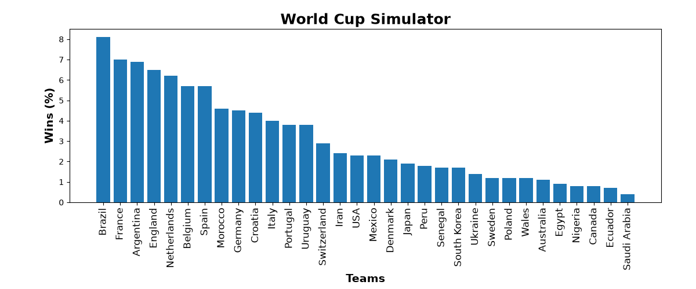
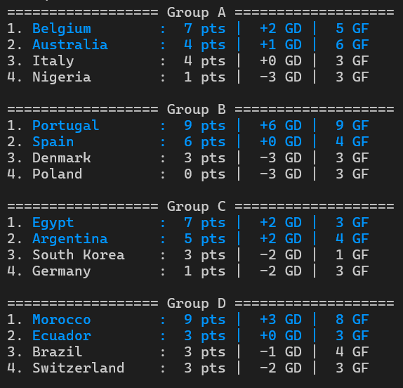
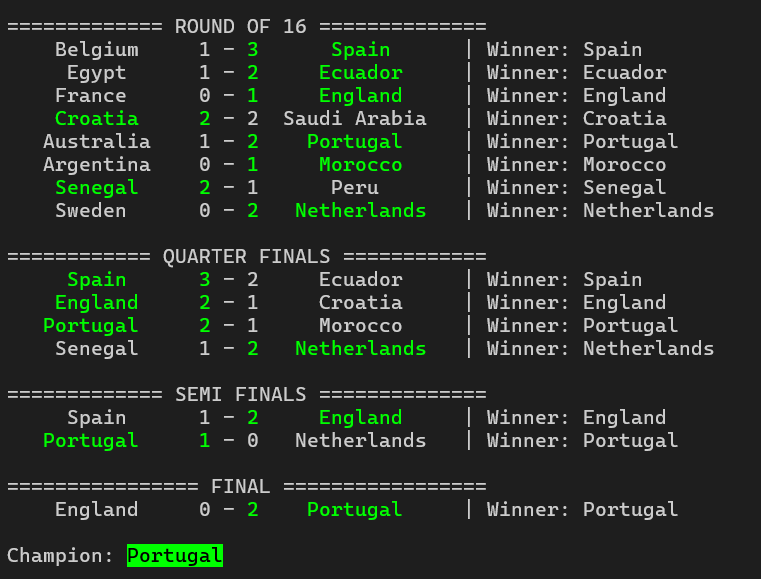

# World Cup Simulator (CLI)
<p align="center">
  
  
  
  
</p>
<h3 align="center">
A command-line World Cup simulator with <strong>Python</strong>.  
</h3>

---

## Preview

<p align="center">
  
</p>

<p align="center">
  
  
</p>

## Features

- Simulates a World Cup tournament
- Automatic group stage generation
- Knockout stage
- Randomized match results
- Colored terminal output

---

## Project Structure

```text
WorldCupSimulator-CLI/
│
├── worldcup.py
├── group.py
├── printer.py
├── main.py
├── match.py
├── team.py
├── knockoutstage.py
├── README.md
└── .gitignore
```

---

## Getting Started

### 1. Clone the repository

```bash
git clone https://github.com/Soheil-Shabanian/WorldCupSimulator-CLI.git
cd WorldCupSimulator-CLI
```

### 2. Install dependencies

```bash
pip install -r requirements.txt
```

## 3. Run

```bash
python main.py
```

---

